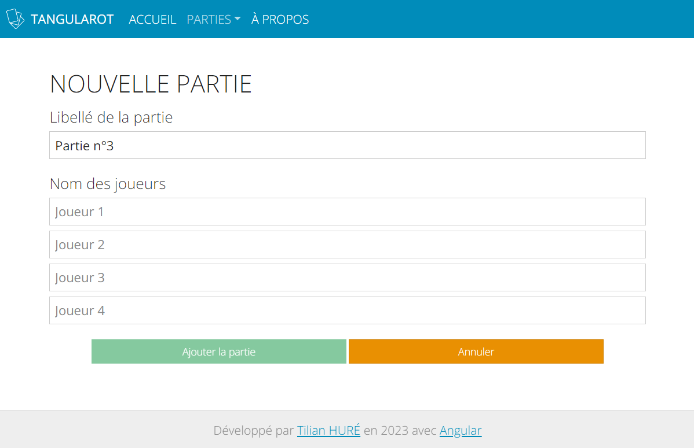

= Dossier de conception de l'application Tangularot
:toc:
:toc-title: Sommaire

*Tilian HURÉ (2A)*

{empty} +

== 1) Tangularot
[.text-justify]
*Tangularot* est une application entièrement réalisée avec le framework https://angular.io/[Angular]* dans la continuité du second semestre d'un BUT Informatique suivit à l'https://www.iut-blagnac.fr/fr/[IUT de Blagnac]. Les frameworks CSS https://getbootstrap.com/[Bootstrap] et https://bootswatch.com/yeti/[Bootswatch] avec le template "Yeti" ont également été utilisés pour simplifier le développement de l'interface graphique. L'application permet aux adeptes du jeu de cartes https://www.le-tarot.fr/[Tarot] de compter facilement les points obtenus le long de leurs parties.

pass:[*] Voir https://github.com/angular/angular-cli[Angular CLI] (version 15.1.1)

*Ce document détaille les aspects techniques et conceptuels de l'application.*

{empty} +

== 2) Installation et lancement
Pour tout ce qui concerne l'installation et le lancement de l'application, se référer à son https://github.com/Tilian-HURE/Tangularot/blob/main/README.adoc[guide d'installation et de lancement] (fichier `README.adoc`).

{empty} +

== 3) Composants
[.text-justify]
Pour générer une application web, Angular propose l'utilisation de composants constitués d'un fichier de style CSS et d'un template HTML pour gérer la forme des pages, ainsi que d'un fichier TypeScript pour gérer le traitement des données et le fond des pages. Il existe d'autres types de composants pouvant être des classes d'objets ou encore des services permettant des traitements spécifiques de données.

=== 3.1) Arborescence
[.text-justify]
L'arborescence suivante présente l'agencement de tous les repertoires des composants constituant l'application.
----
src
    ├───app
    │   ├───about
    │   ├───footer
    │   ├───header
    │   ├───index
    │   ├───party
    │   │   ├───party-adding
    │   │   ├───party-consulting
    │   │   └───party-item
    │   ├───resources
    │   ├───round
    │   │   ├───round-continuing
    │   │   └───round-item
    │   └───services
    └───environments
----

=== 3.2) Composants de base
[.text-justify]
L'application est constituée de tous les principaux composants détaillés à la suite.

* `app` : globalité de l'application, composé de l'en-tête, du pied de page et d'un container avec le contenu principal des pages
** `about` : page "à propos"
** `footer` : pied de page
** `header` : en-tête permettant la navigation à travers les principales pages de l'application
** `index` : page d'accueil listant toutes les parties en cours ou terminées
** `party-adding` : page d'ajout d'une nouvelle partie
** `party-consulting` : page de consultation d'une partie, listant les manches correspondantes et leurs détails
** `party-item` : informations résumées d'une partie, listé dans la page d'accueil
** `round-continuing` : page de renseignement des données d'une manche pour une partie en cour
** `round-item` : scores d'une manche, listé dans la page de consultation d'une partie

=== 3.3) Classes
[.text-justify]
Le répertoire `resources` contient des classes d'objets TypeScript utilisées par les composants de base de l'application.

* `party.ts` : implémentation d'une partie (id, noms des joueurs, date, manches, etc)
** Enumeration `PartyState` : état d'une partie (en cours ou terminée)
* `round.ts` : implémentation d'une manche (numéro de manche, scores, joueur prenant un pari, etc)
** Enumeration `Bet` : différents types de pari (petite, garde, etc)
** Enumeration `Bonus` : types de primes supplémentaires et leur score
* `tools.ts` : méthodes statiques utilisées par certains composants
** Méthode `getCurrentStringDate` : reformate une date donnée en chaine de caractères et en format français
** Méthode `getLatestTimeLabel` : renvoie un label du temps écoulé entre la date donnée et la date actuelle (aujourd'hui, il y a 1 jour(s), il y a 2 semaine(s), etc)

=== 3.4) Service et base de données JSON
[.text-justify]
L'application utilise une base de données JSON afin de stocker les informations des parties et de leurs manches. Un composant appelé service permet de faire la liaison et de manipuler les données entre la base de données et les composants de l'application.

[.text-justify]
Le service utilisé dans le repertoire `services` requiert lui-même l'utilisation d'environnements permettant la connexion avec la base de données. Il s'agit d'un composant TypeScript `party.service.ts` proposant les méthodes suivantes.

* `getParties` : récupère la liste de toutes les parties stockées
* `getParty` : récupère les données d'une partie en particulier à partir de son ID
* `addParty` : ajoute une partie
* `updateParty` : modifie une partie à partir de son ID
* `removeParty` : supprime une partie à partir de son ID

{empty} +

== 4) Routes
[.text-justify]
Pour ne pas perdre ses données stockées en mémoire vive lors de chaque changement de page, Angular propose l'utilisation de routes permettant de changer l'affichage d'un composant pour un autre sans perdre les données volatiles.

=== 4.1) Liste des routes
[.text-justify]
Tangularot utilise plusieurs routes afin de relier ses composants graphiquement. Voici une liste de toutes les routes utilisées et renseignées dans le fichier `app-routing.module`.

* `partie/nouvelle` : redirige vers le composant `party-adding` afin d'ajouter une nouvelle partie
* `partie/:id/continuer` : redirige vers le composant `round-continuing` afin de continuer une partie en fonction de l'ID renseigné
* `partie/:id` : redirige vers le composant `party-consulting` afin de consulter toutes les données d'une partie et de ses manches en fonction de l'ID renseigné
* `apropos` : redirige vers le composant `about` présentant une page "à propos"
* `{empty}` (vide) : redirige vers le composant `index` soit la page d'accueil de l'application, listant toutes les parties enregistrées

=== 4.2) Diagramme de passage
[.text-justify]
Le diagramme suivant illustre toutes les liaisons entre chaque composant via les routes listées.

{empty} +

== 5) Fonctionnalités
=== 5.1) Fonctionnalités minimales
==== 5.1.1) Listage des parties
[.text-justify]
Sur la page d'accueil de l'application sont listées toutes les parties enregistrées dans la base de données. Il est également possible d'accéder à cette page depuis l'en-tête de l'application en cliquant sur le lien "ACCUEIL". Chaque partie listée possède un résumé avec les informations suivantes.

* son libellé
* son état (en cours ou terminée)
* son nombre de manches (/4)
* sa date de départ
* le temps (approximatif) écoulé depuis sa dernière manche (ou depuis sa création s'il n'y a pas encore de manche)
* sa date de fin (si elle est terminée)
* le nom des joueurs

===== Composants et méthodes concernés
* `header` : redirection vers la page d'accueil
* `index` : page de listage des parties
* `party-item` : élément listé comportant les données d'une partie
* `party.service` : manipulation des données de la base de données JSON
** Méthode `getParties` : récupération de toutes les parties enregistrées
* `party` : implémentation d'une partie

==== 5.1.2) Ajout d'une partie
[.text-justify]
Il est possible d'accéder à un formulaire permettant l'ajout d'une nouvelle partie depuis la page d'accueil en cliquant sur le bouton "Nouvelle partie". Ce formulaire nécessite de compléter tous les champs suivants.

* le libellé de la partie (par défaut ce champ est complété avec le numéro de la partie)
* le nom des 4 joueurs

[.text-justify]
Le formulaire peut-être annulé à tout moment, ce qui renvoie vers la page d'accueil. S'il est validé, la partie est ajoutée dans la base de données JSON et une redirection vers la page d'accueil est également effectuée. La nouvelle partie se trouvera en bas de la liste présentée.

===== Composants et méthodes concernés
* `index` : redirection vers la page du formulaire
* `party-adding` : page avec le formulaire d'ajout d'une partie
* `party.service` : manipulation des données de la base de données JSON
** Méthode `getParty` : récupération de la dernière partie enregistrée
** Méthode `addParty` : ajout de la nouvelle partie
* `party` : implémentation d'une partie

==== 5.1.4) Continuation d'une partie
[.text-justify]
Pour une partie en cours, il est possible d'accéder à un formulaire permettant la saisie des données d'une nouvelle manche depuis la page de consultation de la partie en cliquant sur le bouton "Continuer la partie". Ce formulaire nécessite de compléter les champs suivants.

* le preneur (joueur effectuant le pari)
* le type de pari choisi
* le nombre de oudlers obtenus
* le score du preneur obtenu avec ses cartes
* si le preneur à réussi un "petit au bout" (champ optionnel)
* l'éventuelle poignée annoncée par le preneur (champ optionnel)

[.text-justify]
Le formulaire peut-être annulé à tout moment, ce qui renvoie vers la page de consultation de la partie. S'il est validé, la manche est ajoutée, la partie mise à jour dans la base de données JSON et une redirection vers la page de consultation de la partie est également effectuée. La nouvelle manche se trouvera à la suite des autres.

===== Composants et méthodes concernés
* `party-consulting` : redirection vers la page du formulaire
* `round-continuing` : page avec le formulaire de saisie des données de la nouvelle manche
* `party.service` : manipulation des données de la base de données JSON
** Méthode `getParty` : récupération de la partie consultée
** Méthode `updateParty` : mise à jour de la partie une fois la nouvelle manche ajoutée
* `party` : implémentation d'une partie
* `round` : implémentation d'une manche

==== 5.1.3) Consultation d'une partie et de ses manches
[.text-justify]
Il est possible de consulter des parties même lorsqu'elles sont terminées. Cela peut se faire via la page d'accueil en cliquant sur le bouton "Continuer" (pour les parties en cours) ou "Consulter" (pour les parties terminées) d'un élément d'une partie, ou via l'en-tête du site en cliquant sur la partie souhaitée dans la liste déroulantes "PARTIES". La page de consultation d'une partie contient les informations suivantes.

* son libellé
* son état (en cours ou terminée)
* son nombre de manches (/4)
* sa date de départ
* sa date de fin (si elle est terminée)
* un tableau comprenant le score de chaque joueur par manche

[.text-justify]
Le tableau affiche les données essentielles des scores de la partie pour chaque manche et joueur. Sont donc présentés pour chaque manche :

* le numéro de la manche
* le score des 4 joueurs
* les points gagnés ou perdus par rapport à la dernière manche pour chaque joueur

===== Composants et méthodes concernés
* `index` et `header` : redirection vers la page de consultation
* `party-consulting` : page avec les données d'une partie et de ses manches
* `round-item` : ligne du tableau des manches avec les scores des joueurs
* `party.service` : manipulation des données de la base de données JSON
** Méthode `getParty` : récupération de la partie consultée
* `party` : implémentation d'une partie
* `round` : implémentation d'une manche

=== 5.2) Fonctionnalités bonus
==== 5.2.1) Consultation des données d'une manche en détail
[.text-justify]
Sur la page de consultation d'une partie, il est possible d'accéder à une fenêtre détaillant davantage les données d'une manche en cliquant sur le bouton "Voir plus" de la manche souhaitée. La fenêtre peut contenir les informations suivantes.

* le numéro de la manche
* la date de la manche
* le nom du preneur
* le type de pari choisi
* le nombre de oudlers obtenus
* le score du preneur obtenu avec ses cartes
* si le preneur à réussi un "petit au bout"
* l'éventuelle poignée annoncée par le preneur
* si le preneur a gagné ou perdu la manche et de combien de points
* le score total (en prenant en compte le type de pari et les primes)

===== Composants et méthodes concernés
* `party-consulting` : page avec les données d'une partie et de ses manches
* `round-item` : ligne du tableau des manches avec les scores des joueurs
* `party.service` : manipulation des données de la base de données JSON
** Méthode `getParty` : récupération de la partie consultée
* `party` : implémentation d'une partie
* `round` : implémentation d'une manche

==== 5.2.2) Suppression d'une partie
[.text-justify]
Il est possible de supprimer une partie depuis la page d'accueil de l'application, en cliquant sur le bouton "Supprimer" de l'élément souhaité de la liste des parties. Une fenêtre s'ouvrira afin de confirmer ou non la suppression. Dans le cas nominal, la partie est supprimée de la base de données JSON.

===== Composants et méthodes concernés
* `index` : page de listage des parties
* `party-item` : élément listé comportant les données d'une partie
* `party.service` : manipulation des données de la base de données JSON
** Méthode `getParties` : récupération de toutes les parties enregistrées
** Méthode `removeParty` : suppression de la partie sélectionnée
* `party` : implémentation d'une partie

==== 5.2.3) Listage des parties dans le header
[.text-justify]
Comme indiqué précédemment, les parties peuvent également être consultées depuis l'en-tête de l'application via la liste déroulante "PARTIES".

image::src/assets/images/dossier_de_conception/fonc7.png[,725]

===== Composants et méthodes concernés
* `header` : listage des parties
* `party.service` : manipulation des données de la base de données JSON
** Méthode `getParties` : récupération des parties enregistrées
* `party` : implémentation d'une partie

==== 5.2.4) Messages d'erreur
[.text-justify]
Si l'application rencontre des problèmes de connexion avec la base de données JSON, un message d'erreur en conséquence sera affiché afin d'informer l'utilisateur. Les messages possibles concernent les erreurs suivantes.

* lors de récupération de données
* lors de l'ajout de données
* lors de la modification de données
* lors de la suppression de données

===== Composants et méthodes concernés
* `index`
* `party-adding`
* `round-continuing`

==== 5.2.5) Page "à propos"
[.text-justify]
Accessible depuis l'en-tête de l'application en cliquant sur le lien "À PROPOS", une page du même nom a été ajoutée afin de renseigner quelques détails sur l'application et son contexte.

===== Composants et méthodes concernés
* `header` : redirection vers la page "à propos"
* `about` : page "à propos" contenant les détails de l'application

==== 5.2.6) Responsivité
[.text-justify]
Bien que les frameworks CSS Bootstrap et Bootswatch aient été utilisés pour la conception de l'interface graphique de l'application, cette dernière présentait tout de même certains problèmes de responsivité. Tous les composants de l'application ont donc été conçus afin de rendre cette dernière graphiquement compatible avec tous les formats, grands écrans comme petits écrans de smartphones.

