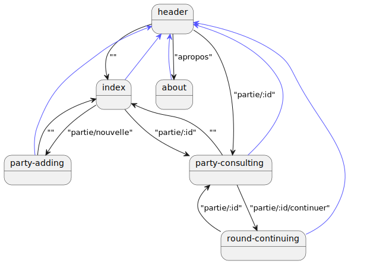

= Dossier de conception de Tangularot
:toc:
:toc-title: Sommaire

*Tilian HURÉ (2A)*

{empty} +

== 1) Tangularot
[.text-justify]
*Tangularot* est une application entièrement réalisée avec le framework https://angular.io/[Angular]* dans la continuité du second semestre d'un BUT Informatique suivit à l'https://www.iut-blagnac.fr/fr/[IUT de Blagnac]. Les frameworks CSS https://getbootstrap.com/[Bootstrap] et https://bootswatch.com/yeti/[Bootswatch] avec le template "Yeti" ont également été utilisés pour simplifier le développement de l'interface graphique. L'application permet aux adeptes du jeu de cartes https://www.le-tarot.fr/[Tarot] de compter facilement les points obtenus le long de leurs parties.

pass:[*] Voir https://github.com/angular/angular-cli[Angular CLI] (version 15.1.1)

*Ce document détaille les aspects techniques et conceptuels de l'application.*

{empty} +

== 2) Installation et lancement
Pour tout ce qui concerne l'installation et le lancement de l'application, se référer à son https://github.com/Tilian-HURE/Tangularot/blob/main/README.adoc[guide d'installation et de lancement] (fichier `README.adoc`).

{empty} +

== 3) Composants
[.text-justify]
Pour générer une application web, Angular propose l'utilisation de composants constitués d'un fichier de style CSS et d'un template HTML pour gérer la forme des pages, ainsi que d'un fichier TypeScript pour gérer le traitement des données et le fond des pages. Il existe d'autres types de composants pouvant être des classes d'objets ou encore des services permettant des traitements spécifiques de données.

=== 3.1) Arborescence
[.text-justify]
L'arborescence suivante présente l'agencement de tous les repertoires des composants constituant l'application.
----
src
    ├───app
    │   ├───about
    │   ├───footer
    │   ├───header
    │   ├───index
    │   ├───party
    │   │   ├───party-adding
    │   │   ├───party-consulting
    │   │   └───party-item
    │   ├───resources
    │   ├───round
    │   │   ├───round-continuing
    │   │   └───round-item
    │   └───services
    └───environments
----

=== 3.2) Composants de base
[.text-justify]
L'application est constituée de tous les principaux composants détaillés à la suite.

* `app` : globalité de l'application, composé de l'en-tête, du pied de page et d'un container avec le contenu principal des pages
** `about` : page "à propos"
** `footer` : pied de page
** `header` : en-tête permettant la navigation à travers les principales pages de l'application
** `index` : page d'accueil listant toutes les parties en cours ou terminées
** `party-adding` : page d'ajout d'une nouvelle partie
** `party-consulting` : page de consultation d'une partie, listant les manches correspondantes et leurs détails
** `party-item` : informations résumées d'une partie, listé dans la page d'accueil
** `round-continuing` : page de renseignement des données d'une manche pour une partie en cour
** `round-item` : scores d'une manche, listé dans la page de consultation d'une partie

=== 3.3) Classes
[.text-justify]
Le répertoire `resources` contient des classes d'objets TypeScript utilisées par les composants de base de l'application.

* `party.ts` : implémentation d'une partie (id, noms des joueurs, date, manches, etc)
** Enumeration `PartyState` : état d'une partie (en cours ou terminée)
* `round.ts` : implémentation d'une manche (numéro de manche, scores, joueur prenant un pari, etc)
** Enumeration `Bet` : différents types de pari (petite, garde, etc)
** Enumeration `Bonus` : types de primes supplémentaires et leur score
* `tools.ts` : méthodes statiques utilisées par certains composants
** Méthode `getCurrentStringDate` : reformate une date donnée en chaine de caractères et en format français
** Méthode `getLatestTimeLabel` : renvoie un label du temps écoulé entre la date donnée et la date actuelle (aujourd'hui, il y a 1 jour(s), il y a 2 semaine(s), etc)

=== 3.4) Service et base de données JSON
[.text-justify]
L'application utilise une base de données JSON afin de stocker les informations des parties et de leurs manches. Un composant appelé service permet de faire la liaison et de manipuler les données entre la base de données et les composants de l'application.

[.text-justify]
Le service utilisé dans le repertoire `services` requiert lui-même l'utilisation d'environnements permettant la connexion avec la base de données. Il s'agit d'un composant TypeScript `party.service.ts` proposant les méthodes suivantes.

* `getParties` : récupère la liste de toutes les parties stockées
* `getParty` : récupère les données d'une partie en particulier à partir de son ID
* `addParty` : ajoute une partie
* `updateParty` : modifie une partie à partir de son ID
* `removeParty` : supprime une partie à partir de son ID

{empty} +

== 4) Routes
[.text-justify]
Pour ne pas perdre ses données stockées en mémoire vive lors de chaque changement de page, Angular propose l'utilisation de routes permettant de changer l'affichage d'un composant pour un autre sans perdre les données volatiles.

=== 4.1) Liste des routes
[.text-justify]
Tangularot utilise plusieurs routes afin de relier ses composants graphiquement. Voici une liste de toutes les routes utilisées et renseignées dans le fichier `app-routing.module`.

* `partie/nouvelle` : redirige vers le composant `party-adding` afin d'ajouter une nouvelle partie
* `partie/:id/continuer` : redirige vers le composant `round-continuing` afin de continuer une partie en fonction de l'ID renseigné
* `partie/:id` : redirige vers le composant `party-consulting` afin de consulter toutes les données d'une partie et de ses manches en fonction de l'ID renseigné
* `apropos` : redirige vers le composant `about` présentant une page "à propos"
* `{empty}` (vide) : redirige vers le composant `index` soit la page d'accueil de l'application, listant toutes les parties enregistrées

=== 4.2) Diagramme de passage
[.text-justify]
Le diagramme suivant illustre toutes les liaisons entre chaque composant via les routes listées.

{empty} +

== 5) Fonctionnalités
=== 5.1) Fonctionnalités minimales
* Consultation de la liste des parties (en cours ou terminées)
* Ajout d'une partie
* Consultation d'une partie et de ses manches (scores)
* Continuation d'une partie (saisir les données d'une nouvelle manche)

=== 5.2) Fonctionnalités bonus
* Suppression d'une partie
* Consultation des données des manches en détail
* Listage des parties dans le header
* Responsivité complète

==== A) Utilisation
==== B) Composants et méthodes concernés
